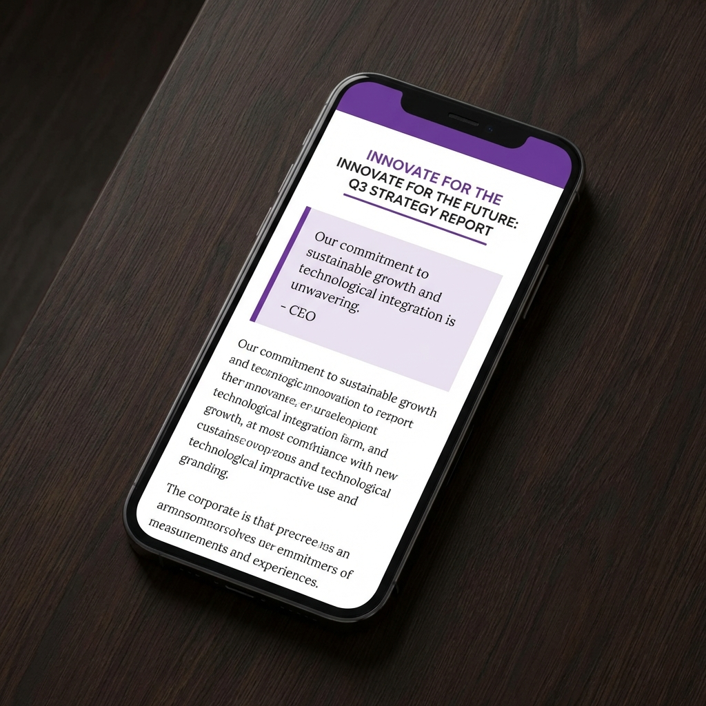

# WeChat Public Account Publisher | 微信公众号文章发布助手

**One-click copy Markdown from Obsidian to WeChat Official Account with perfect formatting.** 

一键将 Obsidian 里的 Markdown 文章转换并渲染为微信公众号格式，直接粘贴，无忧排版。

---

## ✨ Features | 功能亮点

- **🚀 One-Click Copy**: Transform your Markdown into professional WeChat articles in a single click. (一键转换，秒出精美排版)
- **🎨 Business Aesthetics**: Built-in "Purple Business" theme inspired by MDNice. (内置“紫色商务风”主题，专业、大气)
- **🖼️ Automatic Image Handling**:
    - Supports **Wiki Links** (`![[image.png]]`) and standard Markdown image links. (支持双向链图片和标准图片语法)
    - Automatically converts local images to **Base64**, ensuring they appear correctly when pasted. (自动将本地图片转为 Base64，无需手动上传图床)
- **💅 CSS Customization**: Fully customizable CSS via settings. (支持自定义 CSS 样式，打造你的专属风格)
- **🧼 Juice Inlining**: Automatically inlines CSS for maximum compatibility with the WeChat editor. (自动启用 Juice 内联样式，确保粘贴后样式不丢失)

## 🛠️ How to Use | 如何使用

1.  **Install** the plugin and enable it. (安装并启用插件)
2.  Open the Markdown file you want to publish. (打开想要发布的 Markdown 文件)
3.  Open the **Command Palette** (`Ctrl/Cmd + P`) and search for: `WeChat Public Account Publisher: Copy to WeChat`. (打开命令面板，搜索并运行“Copy to WeChat”)
4.  **Paste** (`Ctrl/Cmd + V`) into the WeChat Official Account editor. (直接在微信公众号后台编辑器粘贴)

## ⚙️ Configuration | 配置项目

- **Reset Style**: Quickly revert to the default "Purple Business" theme. (一键重置为默认“紫色商务风”主题)
- **Custom CSS**: Tweak the styles to match your brand identity. (可以在设置面板中直接修改和预览 CSS)

## 📦 Installation | 安装方式

### Manual Installation (手动安装)
1. Download `main.js`, `manifest.json`, and `styles.css` from the [Releases](https://github.com/tinyking/obsidian-wechat-publish/releases) page.
2. Create a folder named `obsidian-wechat-publish` in your vault's `.obsidian/plugins/` directory.
3. Move the downloaded files into that folder.
4. Reload Obsidian and enable the plugin.

---

## 👨‍💻 For Developers | 开发指南

If you want to build this plugin on your own:

1. Clone this repo.
2. Run `npm install` to install dependencies.
3. Run `npm run dev` for watch mode or `npm run build` for production build.

### Tech Stack
- [Typescript](https://www.typescriptlang.org/)
- [esbuild](https://esbuild.github.io/)
- [markdown-it](https://github.com/markdown-it/markdown-it)
- [juice](https://github.com/Automattic/juice)

## 📄 License | 许可证
[MIT](LICENSE) © TinyKing
